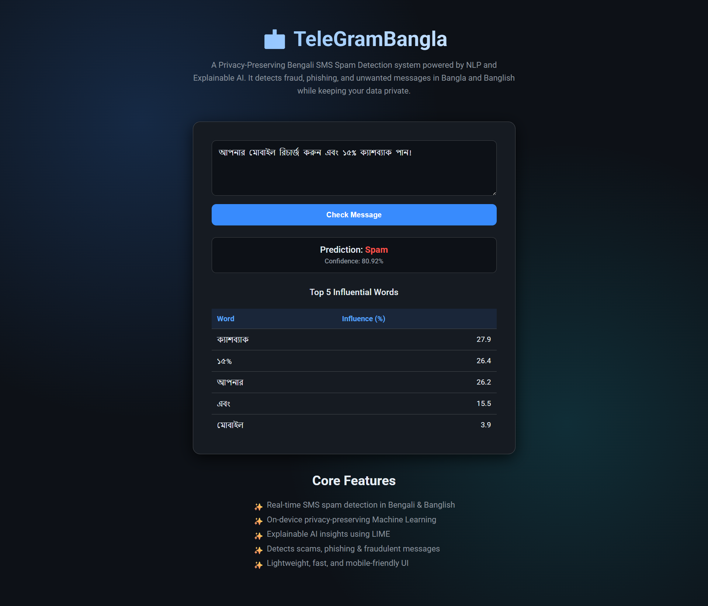

# 📩 TeleGramBangla: Bengali SMS Spam Detection with Explainable AI

**TeleGramBangla** is a privacy-preserving Bengali SMS spam detection system powered by **Machine Learning**, **Natural Language Processing (NLP)**, and **Explainable AI (LIME)**.  
It detects spam messages written in Bengali and Banglish, provides prediction confidence, and explains predictions by showing the top 5 words that influenced the decision.

---

## 🔍 Project Overview

In Bangladesh, SMS spam — including fraudulent messages like fake bKash alerts and phishing attempts — is a major problem, especially in rural areas. TeleGramBangla solves this problem by:

- **Detecting spam in Bengali and Banglish**
- **Maintaining user privacy** through on-device processing
- **Providing explainable AI insights** so users understand why a message was flagged

This project integrates **machine learning** and **LIME (Local Interpretable Model-agnostic Explanations)** into a Flask web application for real-time SMS spam detection.

---

## 🧠 Features

- ✅ **Real-time SMS spam detection** for Bengali & Banglish
- ✅ **Privacy-preserving on-device processing**
- ✅ **Explainable AI using LIME** to show influential words
- ✅ **Prediction confidence (%)**
- ✅ **Beautiful & responsive web UI**
- ✅ **Easy deployment with Flask**

---

## 📊 Explainable AI Component

The LIME explainer helps users understand the model’s decision by:

- Highlighting **top 5 influential words**
- Showing **relative contribution percentages**
- Presenting results in a clean table format

Example Output:

| Word         | Influence (%) |
|--------------|---------------|
| আপনার         | 28.7          |
| মোবাইল       | 26.7          |
| রিচার্জ      | 24.7          |
| ১৫%          | 16.1          |
| ক্যাশব্যাক   | 3.9           |

---

## 🛠 Technology Stack

- **Programming Language:** Python 3.x  
- **Framework:** Flask  
- **Machine Learning:** Scikit-learn  
- **NLP:** TF-IDF Vectorization  
- **Explainability:** LIME (lime.lime_text)  
- **Frontend:** HTML, CSS, JavaScript  
- **Model Storage:** Pickle  
- **Deployment:** Localhost / Server  

---

## ⚙ Installation & Setup

### 1. Clone the repository
```bash
git clone https://github.com/yourusername/TeleGramBangla.git
cd TeleGramBangla
````

### 2. Create a virtual environment

```bash
python3 -m venv venv
source venv/bin/activate   # Linux/Mac
venv\Scripts\activate      # Windows
```

### 3. Install dependencies

```bash
pip install -r requirements.txt
```

### 4. Run the Flask app

```bash
python app.py
```

### 5. Open the app in your browser

```
http://127.0.0.1:5000/
```

---

## 📌 How It Works

1. **Text Preprocessing:**
   The message is cleaned by removing URLs, phone numbers, numbers, punctuation, and extra spaces.

2. **Feature Extraction:**
   TF-IDF vectorizer transforms the message into numerical features.

3. **Prediction:**
   The trained model predicts whether the message is spam or ham.

4. **Explainability:**
   LIME explains the model's prediction by identifying the top words contributing to the decision.

---

## 📝 Requirements (`requirements.txt`)

```
Flask
scikit-learn
lime
numpy
pandas
```

Install with:

```bash
pip install -r requirements.txt
```

---

## 🎨 Web UI

The UI provides:

* Modern, responsive design
* Clear prediction results
* LIME explanation table for transparency


---

## 📈 Future Improvements

* Support for **real-time SMS processing on mobile devices**
* Integration with **federated learning** for privacy-preserving training
* Advanced **Bangla NLP preprocessing**
* Visualization of LIME contributions using bar charts

---

## 🧾 License

This project is licensed under the MIT License — see [LICENSE](LICENSE) for details.

---

## 👤 Author

Md Jisan Ahmed
📧 [jisan3325@gmail.com](mailto:jisan3325@gmail.com)

Isha Das
📧 [isha@idtechsolutionsbd.com](mailto:isha@idtechsolutionsbd.com)


